# Application Overview

## Introduction

Welcome to our geostatistical analysis application! Designed with user experience in focus, this tool integrates the PyQt5 framework to offer an intuitive environment for managing and analyzing spatial data. Here's a quick guide on how to get started and make the most of the application's features.

## Getting Started

### Initial Setup

Upon launching the application, you are presented with a main window organized into five primary sections, each dedicated to a specific part of the analysis process:

- **Select File**
- **Enter Threshold Value**
- **Variogram**
- **Krige Plot**
- **Plots**

### User Interface Layout

The main window, 'KrigeMapPro', displays five primary widgets. Here is the layout:

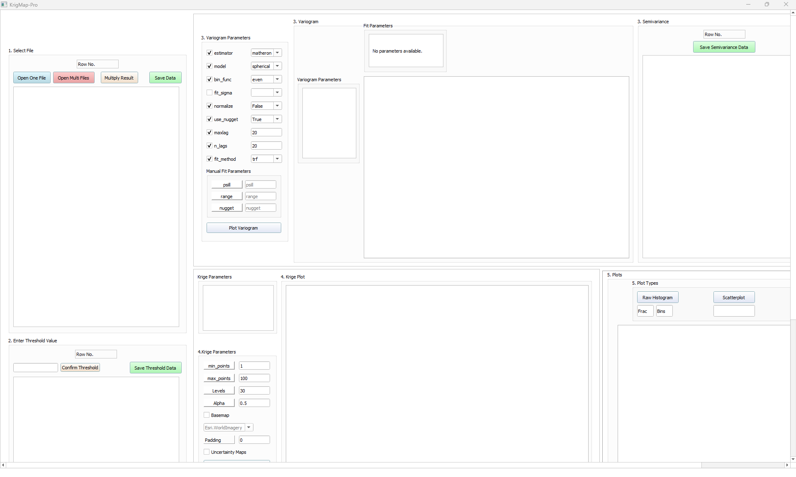

*Figure 3: KrigeMapPro Interface*

### Select File

- **Purpose**: Load your spatial data files (.xlsx, .xls, or .csv).
- **Functionality**:
  - **Single or Multiple File Selection**: Choose to load one or multiple files to suit your data size and needs.
  - **Flexible Data Handling**: Supports various formats with geographic coordinates and results in WGS84 format.

*Figure 4 (Left): Select File widget without any file loaded*

*Figure 4 (Right): Select File widget with a sample .xlsx file loaded*

#### Advanced Column Selection

If a loaded file contains more than three columns, a window prompts the user to specify which columns correspond to Longitude, Latitude, and Results. This ensures that the data is correctly interpreted by the application for geostatistical analysis.

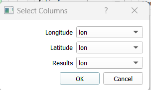

*Figure 5 (Left): Window pop-up if the file loaded has more than three columns*

#### Applying Mathematical Operations

After selecting the relevant columns, users have the option to manipulate the results data by applying mathematical operations. This feature is accessible through the "Multiply Result" button, which opens a new window where users can select result rows and apply operations such as addition, subtraction, multiplication, or division to adjust data units as needed.

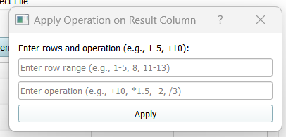

*Figure 5 (Right): Window pop-up for applying mathematical operations to result columns*

### File Selection Buttons

In the **Select File** widget, there are two main options for file handling, enhancing flexibility for users based on their data needs:

- **Open One File**: A straightforward option for loading individual datasets.
- **Open Multi Files**: Allows for the aggregation of data from multiple sources, useful for handling larger datasets.

#### Detailed View

Upon selecting **Open Multi Files**, a new window appears, providing advanced options for handling multiple file inputs:

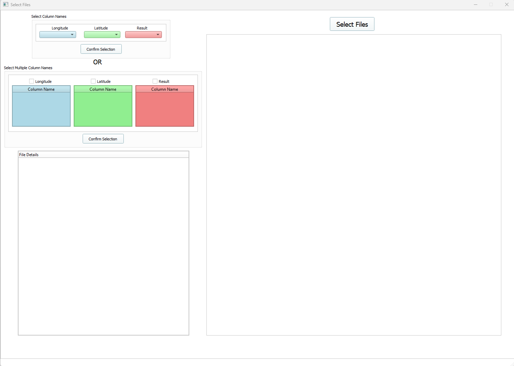
*Figure 6(a): Select Files window without files loaded*

Users can specify column names in one of two ways:

- **Select Column Names**: Use this option if the loaded files have consistent column names for Longitude, Latitude, and Results.
- **Select Multiple Column Names**: Choose this option if you wish to assign different column names for Longitude, Latitude, and Results from various files.

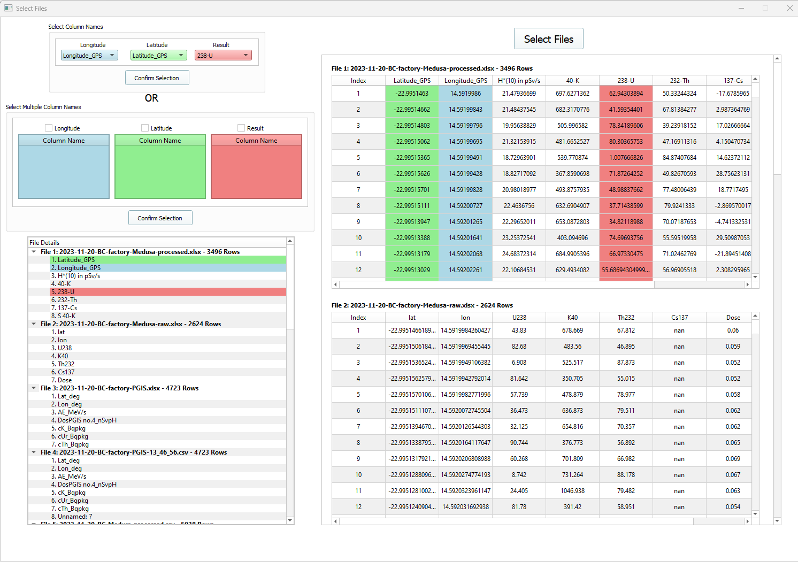
*Figure 6(b): Using Select Column Names for consistent file columns*

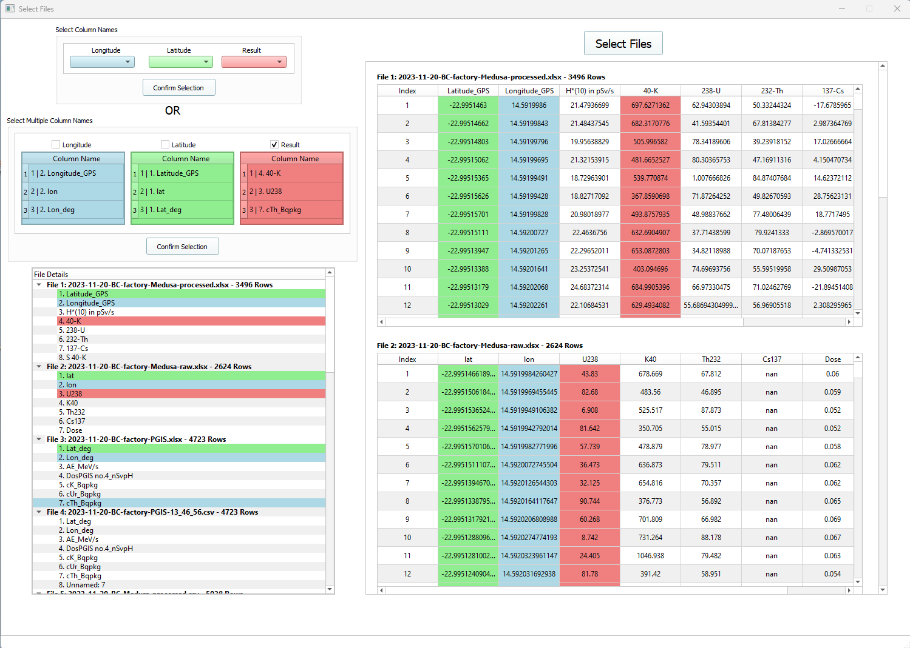
*Figure 6(c): Using Select Multiple Column Names for varied file columns*

These options ensure that users can accurately manage and utilize their spatial data regardless of the initial data configuration, streamlining the process for more complex analyses.

### Enter Threshold Value

- **Purpose**: Refine your data by setting a threshold to filter out closely spaced data points, which enhances the quality of analysis.
- **How to Use**:
  - Input a numerical value in meters to set the minimum distance between data points.
  - Adjust the threshold to see the impact on data quality and quantity directly in the interface.

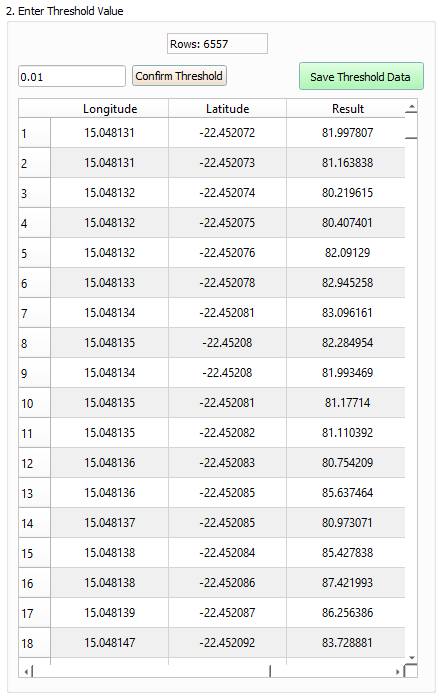

*Figure 7 (Left): Sample data after applying a 0.01m threshold*

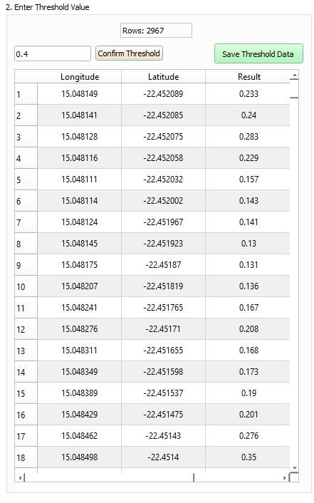

*Figure 7 (Right): Sample data after a 0.4m threshold*

### Variogram

- **Purpose**: Analyze spatial correlations through semivariograms.
- **Features**:
  - **Variogram Parameters**: Customize your analysis by selecting the model type, estimator function, and other relevant parameters.
  - **Interactive Semivariogram Plot**: View and modify semivariograms based on your data and parameters.

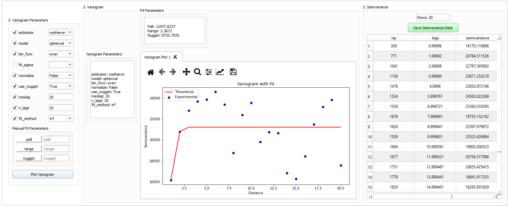

*Figure 8: Illustration of the 3.Variogram widget with a semivariogram created from sample threshold data*

### Krige Plot

- **Purpose**: Perform spatial interpolation to predict phenomena across geographic areas.
- **Capabilities**:
  - **Adjustable Kriging Parameters**: Set the number of points and transparency to tailor the analysis.
  - **Satellite Imagery Overlay**: Enhance geographical context by overlaying maps on the Krige plot.

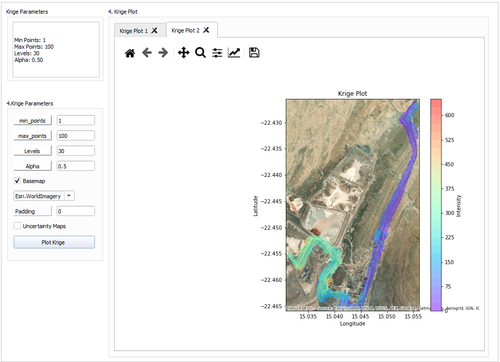

*Figure 10: Krige Plot widget demonstrating a sample semivariogram*

### Plots

- **Purpose**: Explore your data further with additional plotting options.
- **Options**:
  - **Histograms and Scatter Plots**: Visualize data distribution and relationships.
  - **Pair Plots**: Examine pairwise relationships within your dataset.

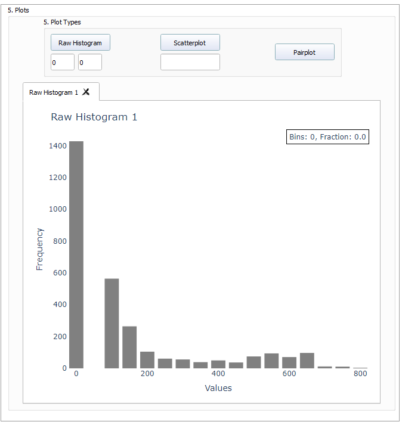

*Figure 11 (Left): Raw Histogram created from sample threshold data*

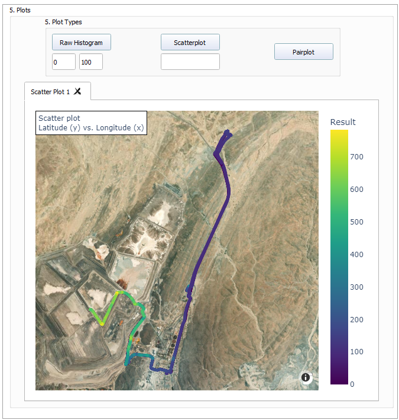

*Figure 11 (Right): Illustration of a scatterplot overlaid with Esri.World Imagery map*

## Conclusion

This guide should help you navigate through the application smoothly and make effective use of the geostatistical tools provided. Load your data, set your parameters, and start kriging with precision and ease.

